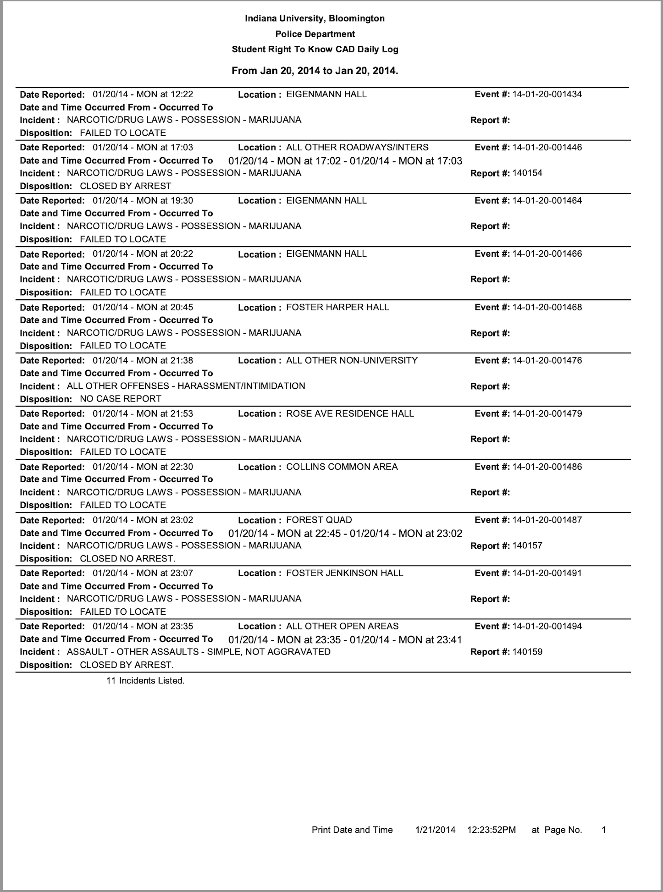

<!-- ```{r setup, include=FALSE} -->
<!-- knitr::opts_chunk$set(echo = F, message = F, warning = F) -->
<!-- knitr::opts_knit$set(root.dir = rprojroot::find_rstudio_root_file()) -->
<!-- ``` -->
\FloatBarrier
# Appendix Figures and Tables \label{section:appendixf}
This page is intentionally blank.

```{=latex}
\begin{figure}[t]
```
```{r ,fig.align = "center" ,out.width= "80%"}

```
```{=latex}
\caption{An Example of a Daily Crime Log \label{crime_log}}
\textit{Note:} The main analysis uses data from 37 universities' Daily Crime Logs - each unique in their own respect. All Daily Crime Logs had to be requested from each university and harmonized using pattern matching.
\end{figure}
```

```{r}
source(paste0(here::here("tables/matching_word_table.R")))
```

```{=latex}
\begin{landscape}
\begin{figure}[t]
```
```{r, echo=FALSE, fig.align = "center",fig.width= 40, fig.height= 28, out.width= "90%"}
top_categories
```
```{=latex}
\caption{Top 15 Most Frequent Offense Matches\label{top_categories}}
\footnotesize{\textit{Note:} The top 15 most frequent offense matches represent the 15 most frequent incidents after the pattern matching exercise. The x-axis represents the fraction of the total number of offenses in each category.}
\end{figure}
\end{landscape}

```


```{r}
source(here::here(paste0("figures/event_study_final_dec13.R")))
```


```{=latex}
\begin{figure}[t]
```
```{r, echo=FALSE}
es_alc_46_g
```
```{=latex}
\caption{Event Study for Alcohol Offenses \label{es_alc_46_g}}
\textit{Note:} The shaded area point estimate represents an entire moratorium period for each university. Hence, the shaded area point estimate has varying amounts of days within based on the university. For instance, Arkansas State University had a 39 day moratorium and therefore their shaded area point estimate would be identified by the 39 moratorium days. Point estimates not within the shaded region are 46 day periods. Number of days within a period was chosen to give approximately two median-length (46 days) moratorium on each side of the shaded area. All periods are normalized by the 46-day period before the moratorium. Alcohol offenses are defined as alcohol offenses per-25000 enrolled students. Controls include holiday, spring semester, day of the week, football game-days, and university by academic year. Standard errors clustered by university. All errorbars represent 95\% confidence intervals.
\end{figure}
```


```{=latex}
\begin{figure}[t]
```
```{r, echo=FALSE}
es_sex_46_g
```
```{=latex}
\caption{Event Study for Sexual Assault Offenses \label{es_sex_46_g}}
\textit{Note:} The shaded area point estimate represents an entire moratorium period for each university. Hence, the shaded area point estimate has varying amounts of days within based on the university. For instance, Arkansas State University had a 39 day moratorium and therefore their shaded area point estimate would be identified by the 39 moratorium days. Point estimates not within the shaded region are 46 day periods. Number of days within a period was chosen to give approximately two median-length (46 days) moratorium on each side of the shaded area. All periods are normalized by the 46-day period before the moratorium. Sexual assault offenses are defined as sexual assault offenses per-25000 enrolled students. Controls include holiday, spring semester, day of the week, football game-days, and university by academic year. Standard errors clustered by university. All errorbars represent 95\% confidence intervals.
\end{figure}
```


```{r}
source(paste0(here::here("figures/leave-one-out-ols.R")))
```


```{=latex}
\begin{figure}[t]
```
```{r}
loo_alc_ols
```
```{=latex}
\caption{Leave-one-out OLS Regressions of Alcohol Offenses \label{loo_alc_ols}}
\textit{Note:} Each blue point represents the preferred specification (2) from Table \ref{main_table}. Each black point represents specification (2) from Table \ref{main_table} with one university omitted from the sample. Offenses are per-25000 enrolled students. Errorbars represent 95\% confidence intervals. Weekends includes only Friday, Saturday, Sunday, while weekdays includes Monday through Thursday.
\end{figure}
```


```{=latex}
\begin{figure}[t]
```
```{r}
loo_sex_ols
```
```{=latex}
\caption{Leave-one-out OLS Regressions of Sexual Assaults \label{loo_sex_ols}}
\textit{Note:} Each blue point represents the preferred specification (2) from Table \ref{main_table}. Each black point represents specification (2) from Table \ref{main_table} with one university omitted from the sample. Offenses are per-25000 enrolled students. Errorbars represent 95\% confidence intervals. Weekends includes only Friday, Saturday, Sunday, while weekdays includes Monday through Thursday.
\end{figure}
```

```{r}
source(paste0(here::here("figures/regressions_forestplot.R")))
```

```{=latex}
\begin{figure}[t]
```

```{r}
alc_forest
```

```{=latex}
\caption{Robustness Across Samples (Alcohol Offenses) \label{alc_forest}}
\textit{Note:} This graph depicts the coefficient estimates and 95\% confidence intervals for different subsets of the sample. The y-axis on the left is the sample selection used, while the y-axis on the left is the point estimate. The x-axis is a number line. All estimates use the preferred specification from Table \ref{main_table} column (2), and all outcomes are in terms of per-25000 enrolled students. Standard errors are clustered at the university level. The ``Main Sample'' refers to the sample used in the main results in Table \ref{main_table} column (2), while the ``Main Sample (Weekends)'' refers to the sample used in the main results restricting to only Friday-Sunday (i.e. Table \ref{main_table} column (4)). The sample ``Main Sample + Never Treated'' is the entire main sample with the inclusion of never-treated universities that were selected from the Niche.com Top 50 Greek Life Schools. Similarly, ``Main Sample + Never Treated (Weekends)'' denotes this sample, but restricted to only Friday-Sunday. Finally, ``Death Trigger + Death Trigger No Moratorium''  denotes the nine universities that experienced a fraternity death as a triggering event for their moratorium in addition to the fifteen universities that also experienced a fraternity death, but no moratorium during the sample period. See Section \ref{section:trigger} for more details.
\end{figure}
```


```{=latex}
\begin{figure}[t]
```

```{r}
sex_forest
```

```{=latex}
\caption{Robustness Across Samples (Sexual Assaults) \label{sex_forest}}
\textit{Note:} This graph depicts the coefficient estimates and 95\% confidence intervals for different subsets of the sample. The y-axis on the left is the sample selection used, while the y-axis on the left is the point estimate. The x-axis is a number line. All estimates use the preferred specification from Table \ref{main_table} column (2), and all outcomes are in terms of per-25000 enrolled students. Standard errors are clustered at the university level. The ``Main Sample'' refers to the sample used in the main results in Table \ref{main_table} column (2), while the ``Main Sample (Weekends)'' refers to the sample used in the main results restricting to only Friday-Sunday (i.e. Table \ref{main_table} column (4)). The sample ``Main Sample + Never Treated'' is the entire main sample with the inclusion of never-treated universities that were selected from the Niche.com Top 50 Greek Life Schools. Similarly, ``Main Sample + Never Treated (Weekends)'' denotes this sample, but restricted to only Friday-Sunday. Finally, ``Death Trigger + Death Trigger No Moratorium''  denotes the nine universities that experienced a fraternity death as a triggering event for their moratorium in addition to the fifteen universities that also experienced a fraternity death, but no moratorium during the sample period. See Section \ref{section:trigger} for more details.
\end{figure}
```

```{r}
source(paste0(here::here("figures/game_weekend_moratorium.R")))
```


```{=latex}
\begin{figure}[t]
```
```{r, fig.height = 10, fig.width = 10}

gridExtra::grid.arrange(game_weekend_plot, left = textGrob("Coefficient Estimate and 95% Confidence Interval",
                                                               rot = 90), bottom = textGrob(""))
```
```{=latex}
\caption{The Effect of Football Game-day Weekends and Football Game-day Weekends + Moratoriums \label{game_weekend_plot}}
\textit{Note:} Game weekends include all football games occurring in the sample period. 34 of the 37 universities have football teams and corresponding game days. The y-axis represents coefficient estimates. Errorbars represent 95\% confidence intervals. Each panel is split into two effects: the first effect being the effect of only football game-day weekends on the outcome per-25000 enrolled students, and the second being the effect of a football game-day weekend that occurs within a moratorium. A game-day weekend is defined as a weekend in which a football game occurs. For example, if a game occurs on a Friday, then Saturday and Sunday will be included in the game weekend. Note that weekends are defined as Friday/Saturday/Sunday. "All Game Weekends" includes both home and away games. The effects of game-day weekends + moratorium is identified by 245 football game days that coincide with moratoriums. Controls include holiday, spring semester, day of the week, and university by academic year. Standard errors are clustered by university.
\end{figure}
```

```{r}
source(here::here(paste0("tables/trigger_event_description.R")))
```

```{r}
reasons_table %>%
  column_spec(1, width = "3cm") %>%
  column_spec(2, width = "8cm") %>%
  column_spec(3, width = "1.5cm") %>%
  column_spec(4, width = "1.5cm") %>%
  kable_styling(font_size = 7, latex_options = "HOLD_position")
```


```{r}
source(paste0(here::here("tables/closure_table.R")))
```


```{r,options(knitr.kable.NA = ''), fig.align = "center"}
## closure_table
closure_table 
```

```{r}
source(paste0(here::here("tables/data_comparison.R")))
```


```{r}
## data_used
data_used
```


```{r}
source(paste0(here::here("tables/regressions_main_poisson.R")))
```

```{r}
## main_table_p
main_table_p 
```


